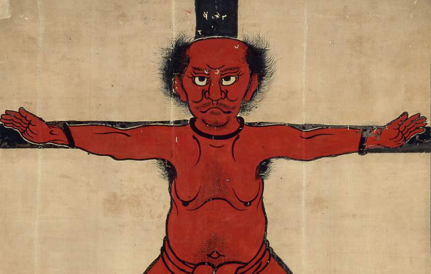

東京大学史料編纂所史料集発刊100周年記念 特別展

# 時を超えて語るもの―史料と美術の名宝―

　歴史研究にとって信頼できる史料集の編纂と出版は不可欠です。東京大学史料編纂所は、明治以来、国の内外から史料を収集して研究し、『大日本史料』や『大日本古文書』などの基本史料集を刊行してきました。1901（明治34）年の発刊からすでに約1000冊を数えます。

　研究編纂の過程で集まった古文書・絵図・絵巻などの史料には、歴史史料として質が高いばかりでなく、美術的にも優れたものが多く含まれています。史料集発刊100周年を記念して行う特別展は、史料編纂所と東京国立博物館の所蔵品を中心とした公家日記、武家文書、絵図・絵巻類など国宝・重要文化財を含む貴重史料160余件を一堂に展観します。

　普段は研究者でも目にすることの少ない貴重な史料を、この機会にひろく一般の方々にもご覧いただき、あらためて過去との出会いを体験していただければ幸いです。

## 開催要項

* 会期／２００１（平成１３）年１２月１１日（火）～２００２（平成１４）年１月２７日（日）
* 会場／東京国立博物館平成館（上野公園）
* 開館時間：午前９時３０分～午後５時（入館は午後４時30分まで）
* 休館日／月曜日（ただし12月24日と1月14日は開館）、12月25日～２００２年（平成14）年1月3日、1月15日は休館
* 観覧料／一般　1000円、高校・大学生　600円、小・中学生　300円(２０名以上は団体料金あり)
* <b>12月11日～１月１４日小中高生無料</b>

## 展示の概要

<figure>
</img>
<figcaption>落合左平次背旗（鳥居強右衛門逆磔図）</figcaption>
</figure>

展示は三部構成となっています。

第一部は史料・美術展示です。史料・美術展示は、<b>「公家日記の世界」</b>、<b>「 武家文書の世界」</b>、<b>「 鎖国と開国」</b>、<b>「国絵図の世界」</b> 、この４つのコーナーから構成されます。史料編纂所と東京国立博物館の所蔵品を中心に、選び抜かれた貴重史料およそ１５０点が一堂に展示されます。

第二部は「東京大学史料編纂所のあゆみ」です。このコーナーでは、史料編纂所の歩みをご紹介し、史料の研究や編纂というものがどのようなものであるか、わかりやすく展示します。また、東博摸本の洛中洛外図屏風の復元模写が展示されるほか、修補・修復、影写、模写など、貴重な史料の収集と保存にあたる専門技術の粋をお見せします。

第三部が「歴史学のデジタル・ミュージアム」になります。これはコンピュータとマルチメディアのコーナーです。ここでは、史料編纂所が蓄積してきた歴史情報データベースへ実際にアクセスしていただき、また、デジタル技術に基づいた最新の歴史学の成果を、音と映像のマルチメディアによってわかりやすく展示します。

詳細は展示紹介をご覧ください。
